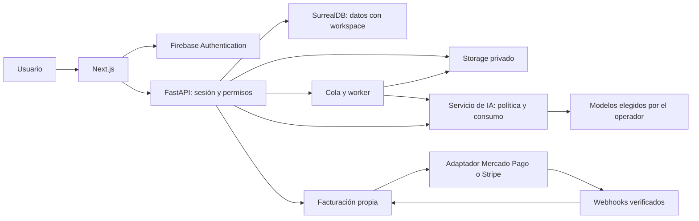

# NextNootbook: producto, cuentas y operación comercial

Fecha: 2026-10-10. Estado: propuesta concreta para implementar en el fork personal; no hay Firebase, aislamiento multiusuario ni cobros activos todavía. Sustituye la propuesta inicial de backend. La instancia local sigue funcionando con sus datos actuales.

## 1. Producto y propuesta de valor

«Convertí tus materiales en comprensión y práctica». El primer público propuesto son estudiantes que ya tienen PDFs, apuntes y clases y necesitan estudiar con referencias fieles. Validar esa hipótesis en una beta antes de ampliar a equipos.

Un usuario entra, sube sus materiales y puede preguntar, obtener resúmenes, guardar notas y practicar con exámenes. No configura proveedores, claves, modelos, embeddings, transformaciones ni contexto técnico. Las prestaciones de estudio están activadas desde el comienzo; el plan determina capacidad, no obliga a descubrir interruptores.

MVP comercial: cuentas individuales, espacio privado, biblioteca de fuentes, cuadernos, notas, resúmenes, chat con imágenes/diagramas y exámenes independientes o dentro del chat. Colaboración, organizaciones y planes de equipo quedan para una etapa posterior. Los controles operativos actuales se trasladan a administración, con autorización real de servidor.

### Recorrido y pantallas

| Pantalla | Lo que debe mostrar y permitir |
|---|---|
| Entrada pública | Qué resuelve, ejemplo real de material convertido en explicación/test, planes claros y «Empezar» |
| Login/registro | Continuar con Google; email y contraseña; recuperación; verificación de email; errores comprensibles; regreso al destino solicitado |
| Primer ingreso | «¿Qué vas a estudiar?» y subir/arrastrar archivos o pegar un enlace; crear el cuaderno y procesar automáticamente; permitir usar las fuentes listas mientras otras siguen procesándose |
| Cuadernos | Continuar donde quedó, crear un cuaderno, abrir sus fuentes y conversación; estado vacío útil, sin métricas de infraestructura |
| Fuentes | Buscar, subir varias, ver progreso individual, cancelar/reintentar, abrir, descargar, asociar a cuadernos y eliminar; distinguir quitar de un cuaderno de borrar de la biblioteca |
| Estudio | Chat protagonista; navegación de fuentes/notas/resúmenes; «Explicame», «Resumí» y «Tomame un examen»; elección de test en chat o examen independiente cuando corresponda |
| Cuenta | Nombre, imagen, email, idioma/tema, seguridad, exportar datos y cerrar cuenta; datos guardados en servidor |
| Plan y uso | Plan vigente, renovación, capacidad disponible, almacenamiento, historial de pagos y gestionar/cancelar; sin nombres de modelos ni tokens |
| Administración | Usuarios, planes, gasto, modelos por tarea, presupuestos, trabajos y pagos; rutas y API exclusivas para operador |

Conservar los materiales neutrales, Liquid Glass en controles, lectura opaca, animación discreta y una zona de scroll por actividad. Reutilizar Arc gratuito y componentes existentes. Login ligero, no un formulario dentro de varias tarjetas; las acciones de cuenta en móvil usan drawers adecuados.

### Prestaciones por defecto

- Extracción, OCR cuando haga falta y el extractor lo permita, indexación y búsqueda listas sin configuración del estudiante.
- Fuentes cargadas en un cuaderno participan automáticamente. Selección de pasajes relevantes y presupuesto de contexto gestionados por el servidor.
- Figuras de fuentes, imágenes adjuntas, gráficos HTML/SVG y referencias activadas. Generar una figura cuando aporte comprensión; no forzar una imagen por respuesta.
- Exámenes con figuras cuando aporten valor; respuestas de desarrollo con texto e imágenes; tests interactivos y preguntas de seguimiento disponibles.
- Guardado automático de conversaciones y borradores, reintentos claros y conservación del texto/adjuntos si falla un envío.
- Una cuenta sin saldo conserva lectura, descarga, exportación y eliminación de sus datos. La generación muestra cuándo se renueva el cupo y permite ampliar el plan.
- Las opciones de accesibilidad y movimiento reducido siguen teniendo prioridad sobre efectos visuales.

## 2. Arquitectura elegida

Mantener Next.js, FastAPI, SurrealDB y el worker. Añadir Firebase Authentication para identidad y Cloud Storage for Firebase para objetos privados. La base de dominio permanece en SurrealDB; no duplicar fuentes/chats en Firestore. Extraer interfaces pequeñas para almacenamiento y facturación; no introducir microservicios para el MVP.

Todo acceso directo por ID, búsqueda vectorial/textual, referencia, figura, stream, historial o trabajo debe validar propiedad. Un filtro en frontend no protege datos.

## 3. Firebase y sesiones

- Google y email/contraseña para el MVP; email verificado para operaciones que consumen IA o almacenamiento. Leer la política actual del servidor en cada acción; no confiar en un estado del navegador.
- Login con Firebase Web SDK. Intercambiar el ID token por una sesión de servidor mediante Firebase Admin SDK. Cookie `HttpOnly`, `Secure`, `SameSite=Lax`, restringida al dominio; duración inicial propuesta: cinco días. Reautenticación reciente para cambiar datos sensibles o cerrar la cuenta.
- Usar mismo origen para web/API y SSE mediante el proxy de Next.js. No mantener tokens de sesión en localStorage; retirar la contraseña compartida del recorrido público. La API verifica la sesión en cada solicitud y el estado de cuenta en servidor.
- CSRF/origin checks en creación de sesión y mutaciones. Logout borra cookie; «cerrar todas las sesiones» revoca sesiones de Firebase. Validar cuentas deshabilitadas/revocadas y proteger cambios de rol.
- `GET /api/me` entrega identidad, preferencias, workspace personal, derechos de uso y resumen de capacidad. Firebase UID se mapea a un usuario interno único. Creación idempotente: el primer ingreso no puede duplicar cuentas.
- Google y email con el mismo correo deben pasar por vinculación de credenciales/reautenticación; no fusionar cuentas solo por coincidencia de email.
- Separar identidad, rol de operador, membresía y suscripción. El pago nunca concede administración. Roles configurados por el operador, sin autopromoción desde la API de perfil.
- Modo local explícito conserva la instalación personal; el modo SaaS debe fallar al iniciar si faltan configuración/credenciales. Nunca hacer fallback a API pública sin autenticación.
- Entornos Firebase dev/staging/prod separados, dominios autorizados, emuladores para pruebas y secretos de servidor fuera del navegador y del repo. Firebase config pública no reemplaza reglas/IAM.

Documentación: [sesiones Firebase](https://firebase.google.com/docs/auth/admin/manage-cookies), [Admin Auth](https://firebase.google.com/docs/auth/admin).

## 4. Propiedad y persistencia

Cada cuenta empieza con un workspace personal y membresía owner. Las entidades y relaciones llevan `workspace_id`; consultas/repositorios reciben un scope obligatorio, no opcional. Jobs llevan `workspace_id`, `actor_id`, `operation_id` y política aplicada; vuelven a validar cuenta y recursos al ejecutar.

Entidades previstas (migraciones aditivas):

| Grupo | Entidades y campos esenciales |
|---|---|
| Identidad | user(firebase_uid único, estado, preferencias), workspace, membership |
| Estudio | notebook, source, note/summary, exam, attempt, chat_session, insight, relaciones: workspace obligatorio |
| Archivos | attachment(storage_provider, object_key, bytes, MIME, hash, estado), attachment_reference, visual_artifact |
| Operaciones | operation(actor, tarea, estado, idempotency_key), job, checkpoint(thread autorizado) |
| Política | plan_version, entitlement, model_policy_version, user_policy_override |
| Consumo | usage_period, usage_reservation, usage_event, provider_call |
| Cobros | billing_customer, subscription(provider y external_id), payment, webhook_event, reconciliation_run |
| Operación | audit_event, account_deletion_job |

Índices únicos en identidad, claves de operación, eventos de cobro y reservas; cantidades monetarias con unidades enteras/decimales exactos, nunca floats. Fechas en UTC y moneda explícita.

El checkpointer SQLite actual no es una persistencia compartida entre réplicas. Antes de desplegar API/worker en varias réplicas, migrar a un backend de checkpoints compartido soportado y ensayar compatibilidad con LangGraph. Evaluación preferida: adaptador PostgreSQL. No seleccionar versiones ni introducirlo sin verificar la versión real del grafo. La autorización del thread se aplica antes del checkpointer, incluida eliminación/limpieza de contexto.

## 5. Gestión completa de archivos

Interfaz `StorageProvider`: iniciar/completar upload, lectura/stream autorizado, materialización temporal para extractores, eliminación y metadata. Adaptadores iniciales Firebase/GCS y local para desarrollo; permitir S3 después sin que el frontend guarde URLs de proveedor como identidad.

- Objetos privados bajo `workspaces/{workspace_id}/attachments/{uuid}`; filename original solo metadata. Todos los artefactos siguen el mismo control: PDFs, imágenes en chats y respuestas de exámenes, recortes, figuras HTML, thumbnails y exportaciones.
- MVP: subir a través de la API autenticada, con límites de cuerpo y streaming. Para archivos grandes, añadir subida reanudable directa con URL temporal emitida por servidor y upload intent vinculado a cuenta, tamaño y expiración; validar el objeto al completar.
- Bucket sin lectura/escritura pública. Con el flujo API-only, las reglas del cliente deniegan accesos directos; la cuenta del backend usa IAM limitado. Firebase Admin/GCS actúa con credenciales de servidor: las reglas de cliente no sustituyen autorización en API.
- Reservar cuota de almacenamiento atómicamente antes de aceptar subida; comprobar tamaño efectivo, MIME por contenido, formatos admitidos y estado. Liberar reservas fallidas/abandonadas. Escaneo/cuarentena antes del procesamiento público, archivos comprimidos y extractores con límites de recursos.
- Estados: uploading, validating, processing, ready, failed, deleting. Mostrar progreso sin exigir saber qué es un embedding. Fallos individuales no descartan el resto de una subida múltiple.
- Worker descarga a un directorio temporal acotado, procesa, publica artefactos y limpia temporales incluso al fallar. No pasar rutas arbitrarias del usuario a extractores.
- Descargar después de verificar propiedad; URL firmada de vida breve o stream de API, nunca enlace público permanente. Visores HTML conservan sandbox sin scripts.
- Duplicados detectados por hash dentro del workspace; no exponer presencia de un archivo en otra cuenta. Las referencias de chats/exámenes evitan borrar adjuntos todavía utilizados.
- Quitar una fuente del cuaderno conserva el archivo en biblioteca; borrado definitivo informa impacto, invalida acceso y elimina datos/objetos mediante job idempotente. Definir ventana de recuperación y tratamiento de backups antes de lanzamiento.
- Descargar originales, exportar notas y conversaciones, y solicitar exportación completa/cierre de cuenta. Los registros de pagos que deban conservarse se separan de los materiales eliminados.
- En SaaS, restringir la descarga de URLs a destinos públicos, bloquear red privada, metadata cloud y rebinding; revisar redirecciones. La política actual permite localhost por el uso local y debe diferenciar ambos modos.

Cloud Storage for Firebase requiere plan Blaze; su coste variable entra en el presupuesto. Configurar región y alertas; una alerta de gasto no constituye un límite duro de gasto. [Requisitos oficiales](https://firebase.google.com/docs/storage/faqs-storage-changes-announced-sept-2024?hl=en), [reglas de Storage](https://firebase.google.com/docs/storage/security).

## 6. Modelos elegidos por el operador y consumo por usuario

### Política de modelos

El estudiante no elige modelos ni suministra credenciales. El operador asigna modelos a chat, contexto largo, resumen, generación de examen, corrección, visión, gráficos, embeddings y OCR/transcripción donde aplique. Puede configurar una política global, una por plan y excepciones por usuario; precedencia: usuario, plan, global. Versionar y auditar cambios.

`ModelPolicy` incluye proveedor/modelo, capacidades requeridas, contexto máximo, salida máxima, esfuerzo de razonamiento permitido, timeouts, herramientas, modelo alternativo autorizado y presupuesto. Verificar visión, tool calling y API compatible antes de asignar. Un cambio de modelo de embeddings necesita reindexación versionada, no se hace como cambio de chat.

El backend deriva el modelo; rechaza `model_override` arbitrarios en modo producto. `provision_langchain_model()` es el punto a extender: su salto automático actual a contexto largo debe obedecer política y cuota. Revisar clientes directos de figuras/visión/exámenes además de los grafos; ninguna llamada puede quedar sin contabilizar.

### Contabilidad y límites

Crear un servicio central de consumo que cubra llamadas HTTP, streams, subllamadas de herramientas y trabajos asíncronos:

1. Autenticar y autorizar operación; resolver derechos, presupuesto y política.
2. Reservar de forma atómica el coste máximo acotado de la operación y un slot de concurrencia. Idempotency key por acción; no repetir una operación facturable al refrescar o reintentar la petición.
3. Acotar tokens de entrada/salida, pasos del agente, figuras, páginas OCR, duración y herramientas. Repartir la reserva entre subllamadas; reservar más antes de gastar más.
4. Registrar cada intento de proveedor, modelo real, versión de tarifa, tokens de entrada/cache/salida, unidades de imagen/OCR/storage y coste estimado/real. Los reintentos consumen presupuesto si el proveedor los cobra.
5. Conciliar uso final, liberar resto y devolver capacidad. Si se pierde metadata o se cancela un stream después de iniciar IA, dejar consumo pendiente con estimación conservadora; no liberar como si hubiese sido gratis. Reconciliar cuando sea posible.
6. Un reconciliador recupera operaciones/reservas abandonadas y distingue jobs en ejecución; no permitir gastar de nuevo solo porque expiró un TTL.

Límites por usuario: presupuesto por período, tope diario, llamadas concurrentes, velocidad, almacenamiento y uploads; también un límite global de plataforma. El plan determina derechos económicos; no sobrescribir el histórico al cambiar suscripción. Períodos vinculados a la suscripción y ledger separado para créditos extra; reglas de prorrateo explícitas.

Mostrar «capacidad de estudio» y almacenamiento en la cuenta, con renovación y aviso previo. Esa unidad comercial debe mapearse a costes mediante una tabla versionada que se valida con datos reales; no fijar créditos arbitrarios. El panel del operador sí muestra tokens, modelos y dinero. No prometer IA ilimitada.

Si hay saturación del modelo, ofrecer espera/reintento y usar solo alternativas aprobadas que mantengan capacidades y presupuesto. El usuario recibe un mensaje útil; nunca el error técnico crudo. Al agotarse capacidad, explicar la renovación/ampliación y conservar la respuesta parcial y el borrador.

## 7. Facturación intercambiable

### Elección inicial

Si el negocio cobra desde Argentina y el público es local, la propuesta inicial es Mercado Pago con suscripciones alojadas y moneda local. Stripe se considera para una entidad en un país admitido y venta internacional; Argentina no figura en la lista de países admitidos consultada. El país del vendedor es distinto del país del comprador. Confirmar país, entidad, moneda y cuenta habilitada antes de elegir producción.

No asumir equivalencia entre proveedores. No fijar comisiones ni impuestos hasta verificar condiciones de la cuenta. Referencias: [Mercado Pago Suscripciones](https://www.mercadopago.com.ar/developers/es/docs/subscriptions/overview), [países Stripe](https://stripe.com/global).

### Contrato y dominio propio

`BillingProvider` recibe datos internos y devuelve resultados normalizados:

- `capabilities()`: suscripciones, cancelación inmediata/al cierre, cambio de plan, devoluciones, portal.
- `create_checkout(user, plan_version, currency, idempotency_key)`.
- `get_subscription(external_id)` y `cancel_subscription(...)`.
- `change_plan(...)` cuando sea compatible; flujo alternativo explícito si no.
- `create_management_link(...)` cuando exista portal; si no, gestión desde UI propia con API autorizada.
- `verify_webhook(raw_body, headers, query)` y `fetch_authoritative_resource(...)`.
- `refund(...)` y conciliación de pagos cuando corresponda.

La configuración elige proveedor por nuevas compras/mercado. Guardar proveedor en cada cliente y suscripción; las existentes continúan bajo su adaptador. Cambiar proveedor no migra automáticamente autorizaciones recurrentes ni tarjetas: requiere un flujo de nueva autorización del usuario y evitar solapamiento de cobros.

Planes internos versionados mapean a identificadores externos por moneda/proveedor. Precio, derechos y producto salen del servidor, no del navegador. Utilizar checkout alojado para no almacenar datos de tarjetas.

### Estados y eventos

Estados internos: pending, trialing si se ofrece prueba, active, past_due, canceled y expired; mantener acceso hasta `entitled_until` según pago confirmado y política de gracia. Cancelar renovación no equivale a cortar inmediatamente el período ya pagado.

Validar firma siguiendo cada proveedor, registrar evento único y responder tras persistencia duradera. Procesar asíncronamente con idempotencia, recursos autoritativos y tolerancia a eventos fuera de orden. No conceder plan por redirección de checkout. Conciliación periódica recupera eventos perdidos; alertar discrepancias. No confundir importe autorizado, pago acreditado, reembolso y contracargo.

Errores, cobros duplicados, renovación fallida, recuperación, cancelación y cambio de plan se prueban en sandbox antes de activar pagos. [Webhooks Mercado Pago](https://www.mercadopago.com.ar/developers/en/docs/zero-dollar-auth/additional-content/your-integrations/notifications/webhooks), [suscripciones Stripe](https://docs.stripe.com/billing/subscriptions/webhooks).

## 8. Viabilidad y planes

Propuesta comercial: prueba gratuita acotada y dos planes personales según capacidad, con todas las funciones de estudio. No publicar aún precios ni «ilimitado». Los planes actuales de equipo son maqueta y no deben venderse antes de contar con colaboración.

Medir coste por usuario activo y por tarea: chat, examen, corrección, generación de gráfico, carga/indexación y almacenamiento/descarga. Separar ingreso, comisiones, infraestructura, soporte, devoluciones y coste de IA.

Modelo de contribución mensual:

`ingreso neto de impuestos - comisión de cobro - IA - extracción - almacenamiento/transferencia - infraestructura asignada - soporte/devoluciones`.

El presupuesto máximo de IA por plan debe caber dentro del ingreso neto menos los demás costes y margen objetivo. Hacer escenarios de uso normal, intensivo y abuso/concurrencia; revisar percentiles y no solo promedio. La prueba gratis tiene presupuesto y límite diario propios. Activación propuesta: primer archivo listo y primera pregunta/test resuelto. Medir tiempo hasta esa activación, fallos de fuentes, retención y conversión sin guardar texto privado en analítica.

Precio/moneda, límites, margen objetivo y política de prueba se fijan después de una beta medida con los modelos que elija el operador. Versionar tarifas de IA para que cambios externos no alteren silenciosamente el saldo ya calculado.

## 9. Contratos API y configuración

| Área | API propuesta |
|---|---|
| Sesión | POST /api/auth/session, DELETE /api/auth/session, POST /api/auth/revoke-sessions |
| Cuenta | GET/PATCH /api/me, GET /api/me/usage, POST /api/me/export, DELETE /api/me |
| Producto | Rutas actuales con scope obligatorio; /api/summaries como entidad propia al migrar marcadores |
| Archivos | POST /api/attachments/uploads, POST /api/attachments/{id}/complete, GET /api/attachments/{id}/download, DELETE /api/attachments/{id} |
| Pagos | GET /api/billing, GET /api/billing/plans, POST /api/billing/checkout, POST /api/billing/manage, POST /api/billing/cancel |
| Eventos | POST /api/billing/webhooks/{provider}, firma y persistencia antes de procesamiento |
| Operador | /api/admin/users, /policies, /plans, /usage, /jobs, /billing, /audit |

Errores con code, message y request_id; usar convenciones de excepciones existentes. Generar tipos desde contratos; seguir apiClient, TanStack Query y las 14 traducciones. Paginar biblioteca/consumo, ninguna API de admin devuelve claves ni material privado por defecto.

Configuración prevista: `NEXTNOOTBOOK_MODE`, Firebase project/bucket y credenciales de servidor por secret manager/identidad de workload; modelo/políticas en DB; secretos de cada proveedor de pagos y sus webhooks; orígenes/dominio y límites globales. Nunca secretos con prefijo NEXT_PUBLIC. Variables exactas se fijan al implementar cada adaptador, no añadir envs sin uso.

## 10. Plan de implementación y aceptación

| Etapa | Entrega | Criterio para pasar |
|---|---|---|
| 1. Fundaciones | Inventario de todas las rutas/queries/objetos/grafos/jobs; ownership, Firebase y sesión; migración de cuenta local | Dos cuentas no pueden acceder a recursos ajenos por ID, búsqueda, referencias, descargas, checkpoints ni jobs. Signup/login/logout/recuperación y revocación probados con emuladores |
| 2. Archivos | Adaptador privado, biblioteca, uploads, cuotas, eliminación/exportación y compatibilidad con extractores | Reinicios conservan figuras e históricos; subida cancelada no consume cuota; duplicados concurrentes, archivos falsos/grandes y eliminación referenciada probados |
| 3. Política IA | Configuración exclusiva de operador, reserva/ledger y límites para todas las llamadas | Dos solicitudes concurrentes no exceden saldo; herramientas/reintentos/cancelación contabilizados; overrides y modelo alternativo no eluden política |
| 4. Experiencia de usuario | Onboarding, estados, perfil persistido y plan/uso; quitar configuración operativa del producto | Primer ingreso hasta primer test fluido en móvil/escritorio, sin claves ni selección de modelo; fallo conserva trabajo; accesibilidad y defaults verificados |
| 5. Cobros | Primer adaptador real, contratos del segundo, sandbox, webhooks y conciliación | Duplicados/fuera de orden/impago/contracargos/cancelación sin doble cargo ni derechos indebidos; no activar compras antes de estas pruebas |
| 6. Beta y lanzamiento | Dominio/TLS, entornos separados, backups, observabilidad y ajustes de planes | Restauración real ensayada; presupuesto global aplicado; aislamiento/carga aprobados; métricas de activación y coste respaldan precios |

Implementar por entregas sobre ramas personales; mantener el PR inicial upstream congelado. La configuración del proyecto Firebase y del negocio de pagos se realiza cuando se disponga de las cuentas; no crear recursos facturables ni activar compras durante esta planificación.

## 11. Migración y operación

Respaldar SurrealDB, originales, artefactos y checkpoints como conjunto antes de migrar. Asignar datos actuales a un workspace de instalación con propietario explícito; conservar IDs, enlaces, respuestas y resúmenes existentes. No adjudicar todo al primer registro público. Backfill con reporte de huérfanos; no activar modo SaaS con recursos sin propietario.

Mantener desarrollo local separado de producción. En SaaS: API y DB detrás de red privada, secretos gestionados, CORS exacto, límites de peticiones, extractor aislado, logs sin textos/claves/URLs firmadas, métricas de gasto/jobs/errores y backups cifrados. Auditoría de rol, política, presupuesto y pagos. El operador tiene herramientas de gestión, no lectura habitual del material de estudiantes.

Retención, exportación, eliminación, términos/privacidad, regiones de Firebase y acuerdos de proveedores se definen antes del lanzamiento según país del negocio. Eliminar cuenta incluye Firebase, workspace y objetos en un job verificable; revocar sesiones primero. Acordar cómo se conservan registros de pago y backups. No hay migración destructiva ni cambio de autenticación de la instancia actual en esta entrega.

## 12. Decisiones pendientes

1. País y entidad desde donde se cobra; público inicial y moneda.
2. Proyecto Firebase y región de almacenamiento/procesamiento.
3. Modelos y proveedores que el operador quiere usar por tarea, incluido embeddings y visión.
4. Presupuesto de beta, margen objetivo y capacidad de la prueba gratuita.
5. Dominio y alojamiento inicial; retención/exportación/recuperación de archivos.

Las primeras decisiones recomendadas ya están especificadas: Firebase Auth, Storage privado abstraído, backend actual, política de modelos del operador, funciones completas por defecto y capacidad controlada por usuario. La elección del primer proveedor de cobro queda condicionada al país.
